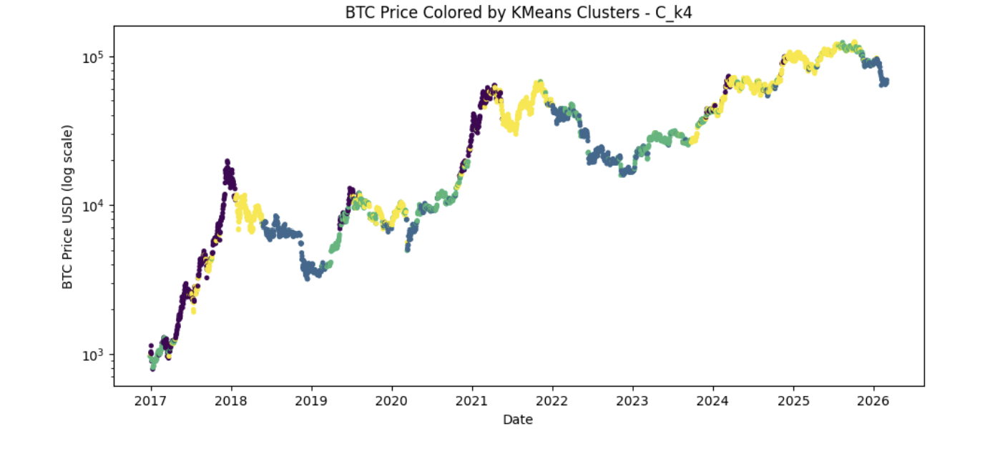
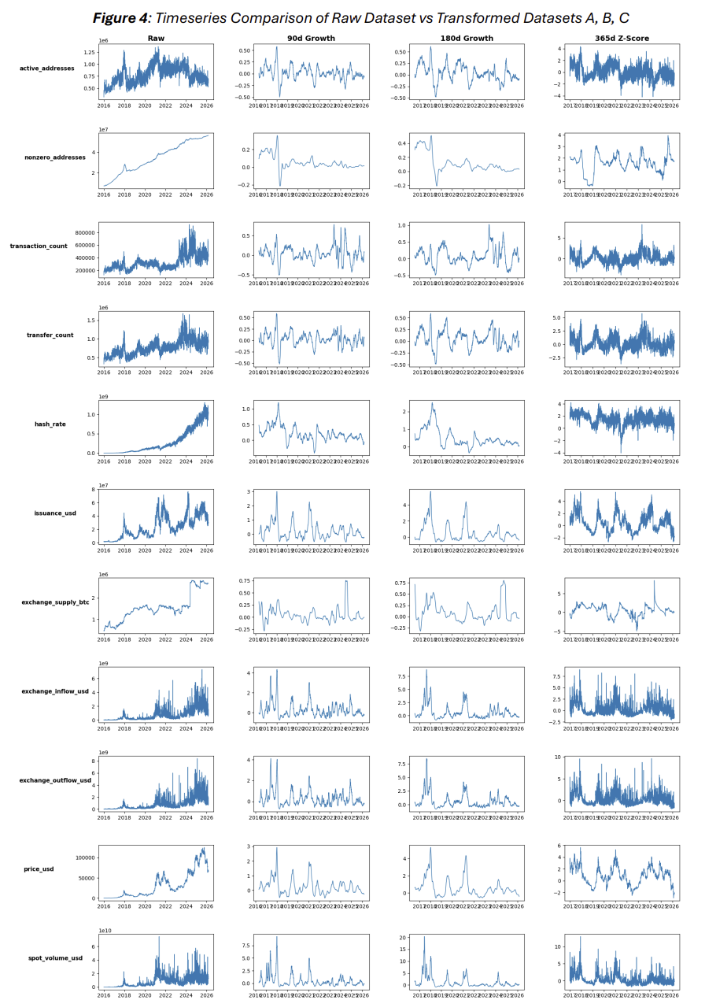
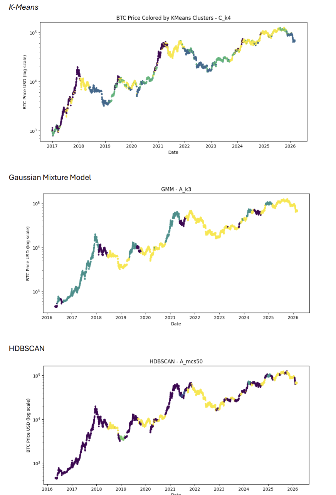
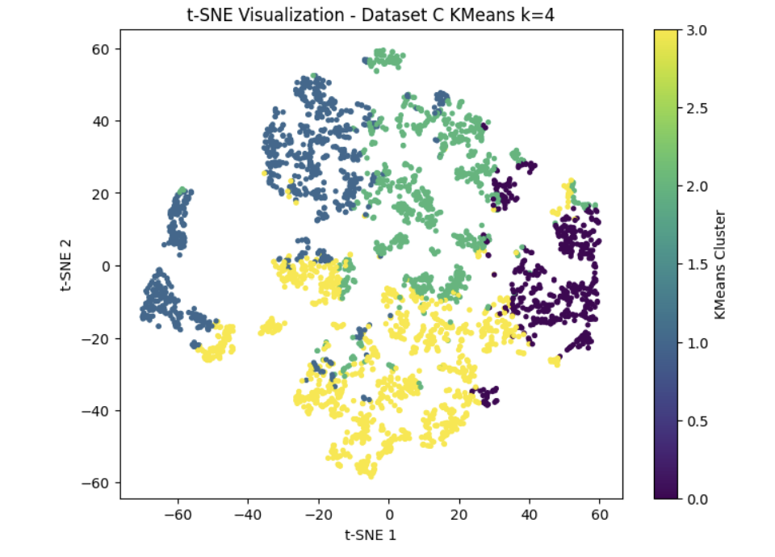

# Bitcoin Market Regime Detection from Market, Network and On-Chain Data

An end-to-end unsupervised machine learning pipeline for discovering **Bitcoin market regimes** from multidimensional crypto data through **feature engineering, dimensionality reduction, clustering, and economic interpretation**.

Instead of relying only on price, the analysis combines **market, network, exchange, mining, valuation, and supply data** to identify latent market states without predefined bull/bear labels.

> **Key result:** Comparing 3 different feature engineering approaches and 3 unsupervised learning methods shows that **good feature engineering is the core to well functioning regime detection with timeseries-data**. The most useful results were found with engineering **365-day rolling Z-scores → PCA (PC&) → K-Means (k = 4)**. This approach finds not only reliable regimes over different Bitcoin Cycles, but also reoccuring early signals of switching regimes (from Bull peaks to sell-offs, i.e. look at the 2017 or 2021 peaks).



---

## Project Overview

Bitcoin and Crypto in general are full of data due to blockchain's transparency. For up to the smallest units of time, one can easily find or access data about not only price, but also trading activity, network usage, exchange flows, mining conditions, valuation, supply dynamics and more.

At the same time, Bitcoin exhibits strong cycles of recurring bull- and bear-markets with many theories being around in the community trying to explain the cycles or predict them in order to be able to profit of buying low and selling high - the theories generally fail, mostly due to every cycle being different and bitcoin's general growth rate over time.

My idea was that there should still be a reliable way to predict if the market really is in a low or a high, even if the new cycle would have a completely new form (length, peak, lowest lows, etc.). It makes sense to me that although every cycle is different - if one makes them comparable and lets a machine on its own learn on them, it should find signals that not only peaks share in all cycles, but bottoms, and transitional phases. And in the best case, also early warning signals of market regimes changes.

This could only work reliably 

1. without giving fixed term labels, as there is no truth about 'bull or bear' in all cases and with me giving the labels, I would most probably distort and bias the data
2. by finding a way of making all cycles as comparable as possible

The project therefore focuses on the complete unsupervised ML pipeline rather than on a single clustering algorithm, with a strong focus on how to prepare and engineer the timeseries data.

### Workflow

- Exploratory Data Analysis
- Feature Engineering (Building 3 different sets, Shortening dataset-variables from 32 to 12/13, transforming via Z-Scores, MAs, Growth Rates, Validating Stationarity, Scaling)
- Dimensionality Reduction (PCA on every set, PC 6 or 7 typically chosen)
- Unsupervised Learning (3 different algorithms)
- Model Comparison
- Cluster Validation
- Regime Detection

---

## Machine Learning Pipeline

```text
            Raw Bitcoin Data 
                    │
                    ▼
 Exploration & Domain-Based Feature Selection
                    │
                    ▼
        Three Feature Representations
   ┌────────────────┴─┬───────────────┐
   ▼                  ▼               ▼
90d Growth MA  180d Growth MA  365d Z-Score
   └────────────────┬─┴───────────────┘
                    ▼
        Feature Validation & Scaling
                    │
                    ▼
        Principal Component Analysis
                    │
                    ▼
            Unsupervised Learning
   ┌────────────────┴─┬───────────────┐
   ▼                  ▼               ▼
K-Means    Gaussian Mixture Models   HDBSCAN
   └────────────────┬─┴───────────────┘
                    ▼
            Cluster Evaluation
                    │
                    ▼
    Economic & Temporal Interpretation
                    │
                    ▼
        Bitcoin Market Regimes
```

---

## Data

The analysis uses **daily Bitcoin data spanning multiple market cycles from 2011-2026**, with an initial dataset of:

- **32 variables**
- **6,269 daily observations**
- multiple dimensions of the Bitcoin ecosystem

The final 14 selected variables encompass the following relevant Bitcoin Regime information

| Category | Example Variables | Information Captured |
|---|---|---|
| **Market and Valuation** | Bitcoin Price, BTC/ETH Ratio, MVRV Ratio | Price dynamics and broader market conditions |
| **Trading Activity** | Spot Volume | Trading activity and liquidity |
| **Network Activity** | Active Addresses, Transaction Count, Transfer Count | Blockchain usage and network demand |
| **Long-Term Demand** | Nonzero Addresses | Long-Term Growth of Network Demand |
| **Exchange Activity** | Exchange Inflows, Exchange Supply | Accumulation, distribution (and initially selling pressure, but highly correlated) |
| **Mining and Network Stress** | Hash Rate, Transaction Fees in BTC | Network security and miner activity |
| **Supply Economics / Valuations** | USD Issuance | Bitcoin issuance dynamics |

---

## Feature Engineering & Data Representation

Many raw crypto variables exhibit strong trends, different scales, and long-term structural changes. Clustering the raw levels directly would therefore only cluster the cycles as wholes.

Instead, **three independent feature representations** are constructed and compared: Every variable was engineered to be stationary and time-encoded, meaning that the same regimes of different cycles should be comparable while also having the time-factor incorporated.

| Dataset | Transformation | Motivation |
|---|---|---|
| **A** | 90-day growth rates of 30-day moving averages | Capture medium-term changes in market conditions |
| **B** | 180-day growth rates of 30-day moving averages | Capture slower market-cycle dynamics |
| **C** | 365-day rolling Z-scores | Measure current conditions relative to their recent historical regime |



The preprocessing pipeline additionally includes:

- missing-value handling
- feature validation
- correlation analysis
- redundancy reduction
- feature scaling

Dataset C — the 365-day rolling Z-score representation — produces the most interpretable regime structure.

---

## Dimensionality Reduction

Principal Component Analysis (**PCA**) is used to reduce redundancy in the engineered feature sets before clustering.

The retained components (6, 7 for Dataset C) preserve **more than 90% of the original variance**, while representing broader latent dimensions of Bitcoin market activity.

The PCA loadings are also examined to interpret the underlying economic dimensions represented by the components rather than treating PCA purely as a black-box preprocessing step.

---

## Clustering Models

Three fundamentally different clustering algorithms are compared:

| Method | Approach | Role |
|---|---|---|
| **K-Means** | Distance-based | Centroid-based regime identification |
| **Gaussian Mixture Models (GMM)** | Probabilistic | Soft assignments and regime uncertainty |
| **HDBSCAN** | Density-based | Irregular cluster structures and noise detection |

Each clustering approach is evaluated across all 3 Datasets

---

## Cluster Evaluation

There is no 'truth' here, but some things make more sense than others. The most important thing here is that clusters should make sense when mapped back to Bitcoin Price History.

What I was looking for here was
a) regimes that are consistent across all 4 Bitcoin cylces
b) the regimes are in itself consistent
c) changing regime colours appear close to peaks in other regimes, indicating very early upcoming regime changes.

---

## Key Findings

- **Feature representation had, with exceptions, a larger impact on the results than the clustering algorithm itself.**
- **365-day rolling Z-scores produced the most interpretable market regimes.**
- **K-Means with four clusters produced the strongest overall regime structure.**
- GMM generated comparable structures but generally less interpretable regime assignments.
- HDBSCAN failed to identify similarly stable market regimes. This makes sense as the regimes of timeseries with cycles are less a thing about density but more about distance.
- The resulting structure extends beyond a simple **bull/bear classification**.
- Several regime transitions occurred before major subsequent price reversals, suggesting potential early-warning information that warrants further validation.

---

## Results

### Comparing Clustering Approaches

The strongest specifications from K-Means, GMM, and HDBSCAN are compared against historical Bitcoin prices. K-Means here performs best because of its usability as a very early warning signal while also elsewise performing consistently.




### Preferred Model

The final preferred specification is:

> **365-Day Rolling Z-Scores → PCA → K-Means (k = 4)**

The four-cluster solution produces comparatively persistent and economically interpretable Bitcoin market states.

Because the preferred regime plot is shown at the top of this README, it is not repeated here.

### Visualizing the Regime Structure

t-SNE is used as an additional visualization of the preferred clustering solution.



**t-SNE is used only for visualization.** The actual clustering is performed on the PCA-reduced feature space.

The visualization provides an additional perspective on the structure captured by the final regime model.

---

## Exploratory Early-Warning Signals

Several transitions in the preferred clustering solution occur **weeks or months before major Bitcoin price reversals**.

This is an interesting exploratory finding, but it does **not** establish out-of-sample predictive power, causality, or a profitable trading signal - not yet.

But for future projects, this could be tested as an indicator - generally, a GMM-output of high-uncertainty areas during market cycles could be added here to filter out 'wrong' warning signals - TBD

---

## Repository Structure

```text
.
├── data/raw/
│
├── figures/
│
├── notebooks/
│   ├── 00_introduction.ipynb
│   ├── 01_exploration.ipynb
│   ├── 02_preprocessing_features.ipynb
│   ├── 03_dimensionality_reduction.ipynb
│   └── 04_clustering.ipynb
│
├── report/
│   └── Robert_Puselja_Unsupervised_ML_Report_UniLu_2026.pdf
│
├── requirements.txt
├── README.md
└── .gitignore
```

---

## Technologies

**Python:** pandas · NumPy · scikit-learn · matplotlib · seaborn

**Machine Learning:** PCA · K-Means · Gaussian Mixture Models · HDBSCAN · t-SNE

**Methods:** Feature Engineering · Dimensionality Reduction · Unsupervised Learning · Cluster Validation · Market Regime Detection

---

## Full Report

The complete project report contains the detailed methodology, feature selection, dimensionality reduction, clustering experiments, evaluation, interpretation, limitations, and additional results.

📄 [`Robert_Puselja_Unsupervised_ML_Report_UniLu_2026.pdf`](report/bitcoin-regime-detection-report.pdf)

The five notebooks contain the complete technical analysis and additional experiments that are not reproduced in the README.

---

# Author

**Robert Puselja**